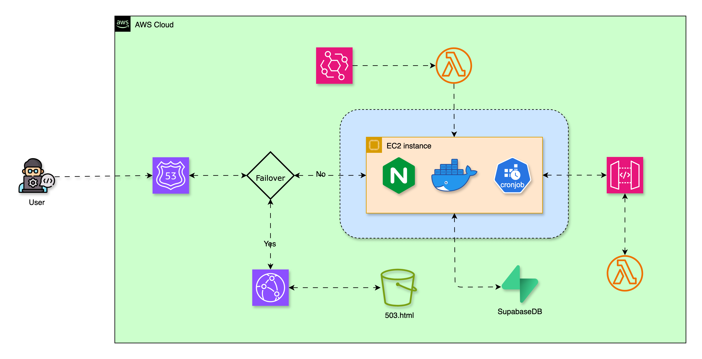

# Personal Portfolio Website

## 📔 Overview

This is a personal portfolio website built to showcase my skills, projects, and professional background. It serves as a central hub to present my software development expertise, particularly in areas such as Machine Learning, NLP, GenAI, and full-stack development. The site features project descriptions, skills, my experience, and contact information, all organized in a clean and user-friendly design.

---

## 📱 Features

- **Responsive Design:** Works seamlessly on desktop and mobile devices.
- **Project Showcase:** Detailed information about projects with links to repositories and demos.
- **Skills Highlight:** Clear presentation of technical skills and tools I work with.
- **Resume Section:** Downloadable and viewable resume.
- **Contact Form:** Easy way for visitors to get in touch.
- **Backend Integration:** Supports dynamic content management and future expansions.
- **Cloud Hosting:** Deployed on AWS for reliable and scalable hosting.

---

## 🛠 Tech Stack  

<table>
  <tr>
    <td><strong>Frontend</strong></td>
    <td>
      
      
      
    </td>
  </tr>
  <tr>
    <td><strong>Backend</strong></td>
    <td>
      
    </td>
  </tr>
  <tr>
    <td><strong>Database</strong></td>
    <td>
      
    </td>
  </tr>
  <tr>
    <td><strong>Cloud Hosting</strong></td>
    <td>
      
      
      
      
      
      
      
    </td>
  </tr>
</table>


---

## 🏗️ Architecture Diagram


👉 [View interactive diagram](https://abhijitdeshpande83.github.io/portfolio/Portfolio_HLD_v3.drawio.html)

## 🚀 Clone the Repository

The easiest way to clone this repo is using HTTPS (no setup required):

```bash
git clone https://github.com/abhijitdeshpande83/portfolio.git
